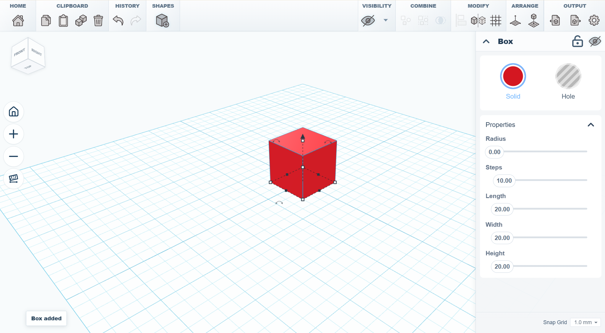

<div align="center">
  <table>
    <tr>
      <td width="145" align="center">
        
      </td>
      <td>
        <h1 align="right">SketchForge</h1>
        <h3 align="right">A local-first 3D design editor that runs in your browser.</h3>
        <p align="right">
          Build shapes, cut holes, group parts, import STL files, and export models without accounts, cloud lock-in, or heavyweight CAD setup.
        </p>
      </td>
    </tr>
  </table>

  <p>
    <a href="LICENSE"></a>
    <a href="https://github.com/Formsmith746/SketchForge-3D/stargazers"></a>
    <a href="https://github.com/sponsors/Formsmith746"></a>
    
    
  </p>
</div>

SketchForge projects can be saved as native editable `.skf` packages and opened later on another browser or device. Unlike STL/OBJ mesh exports, `.skf` preserves shapes, sketches, groups and boolean operands, exact CAD data where available, imported sources, workspace settings, and undo/redo history. See [the `.skf` project format documentation](docs/SKF_PROJECT_FORMAT.md).



## Why SketchForge

SketchForge is a lightweight CAD-style workspace for people who want to sketch, cut, and export 3D models quickly.

It is built for the satisfying loop: drop a shape, resize it, rotate it, make another shape a hole, group the result, import an STL if primitives are not enough, and export the finished model.

No login. No server project storage. No heavyweight CAD install just to make a useful part.

## What It Does

- **Local-first projects** - designs live in browser storage with generated project thumbnails.
- **Real 3D workplane** - grid, camera controls, snap settings, transform handles, outlines, and inspector controls.
- **Primitive shape library** - boxes, cylinders, spheres, cones, pyramids, wedges, text, roofs, half spheres, torus shapes, tubes, and more.
- **Solid and hole workflow** - turn shapes into cutters and group them into final geometry.
- **Boolean Intersection** - keep only the geometry where selected solid and hole shapes overlap.
- **Reversible edge tools** - chamfer and fillet selected CAD edges, with history controls for removing applied edge features.
- **Rotated solid edge treatment** - chamfer and fillet preserve analytic box topology after one-, two-, or three-axis rotations.
- **STL import** - bring outside models into the same workspace as primitives.
- **STL, OBJ, and STEP workflows** - export selected objects or the whole scene, and round-trip exact STEP/B-Rep geometry.
- **Fast browser stack** - Next.js, React, TypeScript, Three.js, and Manifold/CSG geometry tooling.

## Demo


## Getting Started

There are two common ways to run SketchForge. If you are not sure which one to choose, use Docker.

| Path | Best for | Difficulty |
| --- | --- | --- |
| Docker / FabLab server | Teachers, classrooms, shared computers, local network hosting | Recommended |
| Local development | Developers who want to edit the code | Medium |

SketchForge is local-first in both modes. The app files may be served from a computer or server, but projects stay in each user's browser storage. STL and OBJ exports download through the user's browser. SketchForge does not upload models to a SketchForge cloud service.

### Download the Project

If you already know Git:

```bash
git clone https://github.com/Formsmith746/SketchForge-3D.git
cd SketchForge-3D
```

If you do not know Git yet:

1. Open the GitHub page for this repository.
2. Press the green **Code** button.
3. Press **Download ZIP**.
4. Extract the ZIP somewhere easy to find, such as your Desktop.
5. Open a terminal in the extracted folder.

On Windows, you can open PowerShell in the folder by opening the folder, clicking the address bar, typing `powershell`, and pressing Enter.

## Docker / FabLab Server (Recommended)

Docker is the easiest way to run SketchForge for a classroom, workshop, or FabLab. It packages the build tools, static website, Nginx server, health check, and restart behavior together.

### What You Need

- Docker Desktop on Windows or macOS, or Docker Engine on Linux
- Docker Compose, which is included with modern Docker Desktop
- This repository downloaded on the server computer

If `docker` is not recognized, install Docker Desktop and open it once before running the commands.

### Start SketchForge

#### Compose (Build images locally)

From the SketchForge project folder, run:

```bash
docker compose -f deploy/docker/compose.yaml up --build -d
```

The first start can take a few minutes because Docker builds the app.

#### Compose (Prebuilt)

From the SketchForge project folder or with the downloaded `deploy/docker/compose-ghcr.yaml`, run:

```bash
docker compose -f deploy/docker/compose-ghcr.yaml up -d
```

#### Standalone (Prebuilt)

```bash
docker run -d --name sketchforge --restart unless-stopped -p 3000:80 ghcr.io/formsmith746/sketchforge-3d:latest
```

After running, open this on the same computer:

```text
http://127.0.0.1:3000/
```

If that works, SketchForge is running.

### Let Other Computers Join

Other computers on the same Wi-Fi or LAN need the server computer's local IP address.

On Windows PowerShell, run:

```powershell
ipconfig
```

Look for the `IPv4 Address`, for example:

```text
192.168.1.25
```

Then other computers can open:

```text
http://192.168.1.25:3000/
```

Use your own IP address, not the example one.

### Use a Different Port

If port `3000` is already being used, choose another port such as `8080`.

Windows PowerShell:

```powershell
$env:SKETCHFORGE_PORT = "8080"
docker compose -f deploy/docker/compose.yaml up --build -d
```

Linux or macOS:

```bash
SKETCHFORGE_PORT=8080 docker compose -f deploy/docker/compose.yaml up --build -d
```

Then open:

```text
http://127.0.0.1:8080/
```

### Stop SketchForge

```bash
docker compose -f deploy/docker/compose.yaml down
```

### Update SketchForge Later

If you used Git:

```bash
git pull
docker compose -f deploy/docker/compose.yaml up --build -d
```

If you downloaded the ZIP, download the newest ZIP, extract it, and run:

```bash
docker compose -f deploy/docker/compose.yaml up --build -d
```

### Docker Troubleshooting

- **`docker` is not recognized**: install Docker Desktop, open it, and try again.
- **Docker says the daemon is not running**: Docker Desktop is closed or still starting.
- **Port already in use**: use another port, for example `8080`.
- **Other computers cannot connect**: check that they are on the same network and that the server firewall allows the chosen port.
- **The page opens but old files appear**: stop and rebuild with `docker compose -f deploy/docker/compose.yaml down`, then `docker compose -f deploy/docker/compose.yaml up --build -d`.

If you already have Node.js installed, the repository also includes shortcuts:

```bash
npm run docker:up
npm run docker:down
```

## Local Development

Use this path if you want to edit SketchForge's code.

### What You Need

- Node.js 20 or newer
- npm, included with Node.js

Check your versions:

```bash
node -v
npm -v
```

If those commands do not work, install Node.js from the official Node.js website and reopen your terminal.

### Install and Run

From the SketchForge project folder:

```bash
npm install
npm run dev
```

Open:

```text
http://127.0.0.1:3000/
```

Leave the terminal open while you use the app. To stop the development server, press `Ctrl+C` in the terminal.

### Useful Developer Commands

Run TypeScript checks:

```bash
npm run typecheck
```

Run tests:

```bash
npm run test
```

Start the local SketchForge MCP bridge for editor automation:

```bash
npm run mcp:sketchforge
```

Create a production build:

```bash
npm run build
```

Build a static export:

```bash
npm run export
```

## Contributing

Contributions are welcome. Good places to help:

- editor bug fixes
- geometry and boolean test cases
- STL import/export edge cases
- UI polish
- documentation screenshots and videos
- accessibility and performance improvements

Read [.github/CONTRIBUTING.md](.github/CONTRIBUTING.md) before opening a pull request.

## Security

Please do not open public issues for security-sensitive reports. Read [.github/SECURITY.md](.github/SECURITY.md) for the reporting process.

## License

MIT. See [LICENSE](LICENSE).

## SketchForge MCP Skill

SketchForge includes a local MCP server for AI clients that support MCP tools. It lets an agent inspect and control a live local editor tab: list open editors, read the scene, create/update/select objects, group/cut/separate parts, list CAD edge ids, apply chamfer or fillet, inspect errors, and capture viewport images.

This is for local development only. Run SketchForge with `npm run dev`; the MCP route is disabled in production builds and Docker/static hosting.

### Start SketchForge for MCP

From the SketchForge project folder:

```bash
npm install
npm run dev
```

Open an editor tab:

```text
http://127.0.0.1:3000/?editor=1
```

The AI client starts the MCP server with:

```bash
node scripts/sketchforge-mcp-server.mjs
```

### Codex

The Codex skill is included at:

```text
docs/skills/sketchforge-mcp-skill
```

Install it into your Codex skills folder.

Windows PowerShell:

```powershell
New-Item -ItemType Directory -Force "$env:USERPROFILE\.codex\skills" | Out-Null
Copy-Item -Recurse -Force "docs\skills\sketchforge-mcp-skill" "$env:USERPROFILE\.codex\skills\sketchforge-mcp-skill"
```

macOS or Linux:

```bash
mkdir -p ~/.codex/skills
cp -R docs/skills/sketchforge-mcp-skill ~/.codex/skills/
```

Then add an MCP server entry to your Codex config. Use [`docs/mcp/codex-config.example.toml`](docs/mcp/codex-config.example.toml) as the template and replace the script path with the absolute path on your machine. Restart Codex after changing the config.

Once installed, ask Codex:

```text
Use $sketchforge-mcp-skill to list my open SketchForge editors and inspect the current scene.
```

### Claude

Claude does not use Codex `SKILL.md` files, but it can use the same SketchForge MCP server. Add the server to Claude Desktop's MCP config using [`docs/mcp/claude-desktop-config.example.json`](docs/mcp/claude-desktop-config.example.json) as the template, replacing the script path with the absolute path on your machine.

After restarting Claude Desktop, ask:

```text
Use the SketchForge MCP tools to list open editors, inspect the scene, and modify the selected object.
```

The main tool names are `sketchforge_list_editors`, `sketchforge_read_scene`, `sketchforge_list_objects`, `sketchforge_create_shape`, `sketchforge_update_object`, `sketchforge_list_edges`, `sketchforge_apply_edge_treatment`, and `sketchforge_capture_image`.
